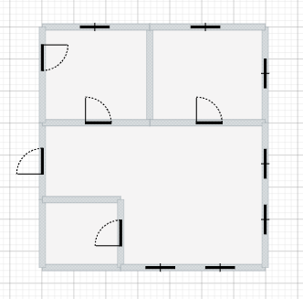
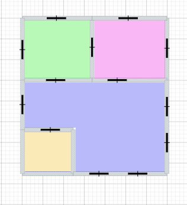
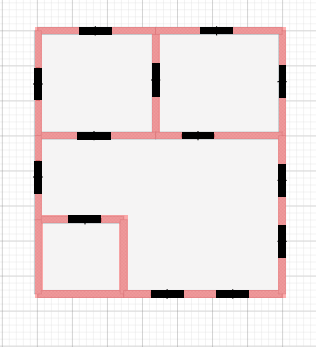
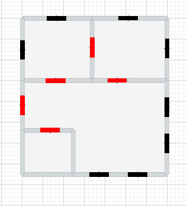
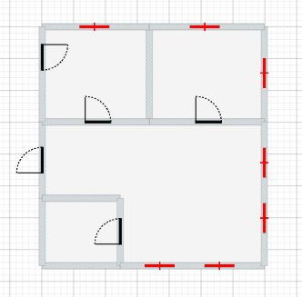

# Task_12-MiniFloorPlan

Prepare component with mini version of the scene with several properties

- Component automaticaly accomodate parent scale with css (it can be used in many places and its scale is determined by its parent)
- type property (determines overall look and bvehaviour of the component)
- scene property determines source of data (iunitial or reform)
- active property (determines which, if any subelement can be highlited)
- clickAction property (passed function trigerred by click action)
- use canvas, or svg after research (let me know first about the results of the research to assist decision process on technology)


```js
Usage example:


<MiniFloorPlan
  type="<null,walls/area/items/doors/windows>"
  interactive="<null,all/walls/area/items/doors/windows>"
  scene={state.scene}
  active="ar0azfu" // ID of the element
  onMouseEnter={projectActions.setTooltip("Walls - overall area:40m2")}
  onClick={null}
  width={<100/null>}
  height={<100>}
/>
```
* type="null"

* type="areas"

* type="walls"

* type="doors"

* type="windows"



Ideally dimmentions (width/height) should be optional. If there will not be any value (null) width/height should be 100% of the parent/container. This way its size will conform to the parent and can be used in multiple places with different sizes without providing additional data.

